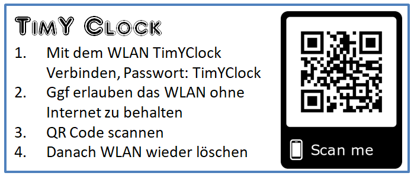

# TimYClock
A configurable Birthday Timer Clock with 4 Modes of opertaion whitch can be configured via WiFi from any mobile device

## Hardware

- NodeMCU ESP8266 (integrated WiFi)
- DS3231 RTC Modul or any other
- MAX7219 modules (as many as you like)

## Modes of operation
1. **Time only**   displays current time centered in the display 

2. **Text only**   displays up to 200 characters of scrolling text

3. **Time an Text**   displays current Time end every 2 minutes starts to scoll the text once. 

4. **Time an Birthday**   displays the current time and every 2 minutes displays a text that shows the days until each family members brthday. 

## Examples

## Manual
